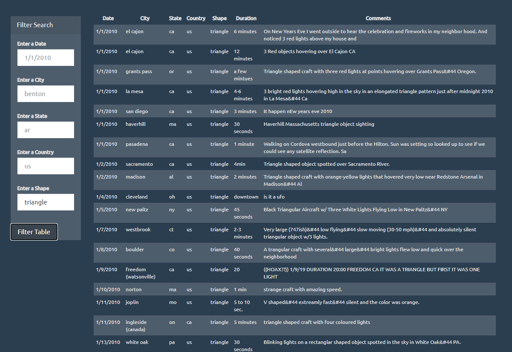

# UFO-Sightings-with-JS
A company has collected several eye-witness reports of UFO sightings in the US. The purpose of this project is to create a dynamic table based upon the dataset of eye-witness reports. The table should also allow users to filter the data for specific values.

## Narrative
The webpage is built to display the data in a table so that users can easily view and filter the date, city, state, country, shape, and comments of each sighting the a side bar on the left.

## Tools and technologies used
1. Java Script- D3 event handlers
2. HTML
3. CSS
4. Github pages

## How to Run the Code
To access link [click here](https://akshitap31.github.io/javascript-challenge/index.html) and play around by filtering on single or multiple parameters in the sidebar

## Output

Home Page

FIltering

